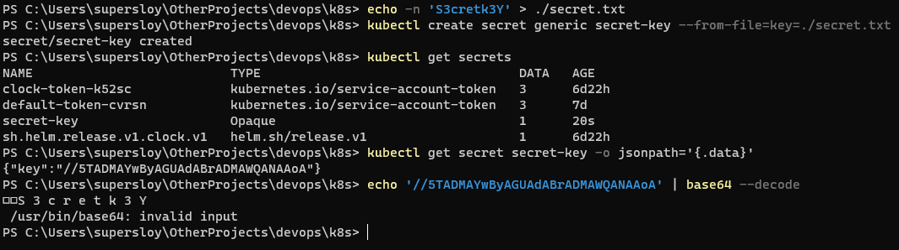
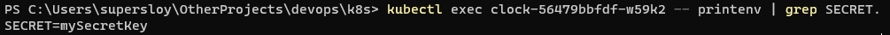

# k8s secrets

1)Step 1&2 of 11lab:



Note: I think the output of last echo is not the same due to the way how Windows works with binary files (you can check secret.txt in text/code editor and it contains strange symbols too)

2) Step 3: (after executing ```helm install clock ./clock```)

